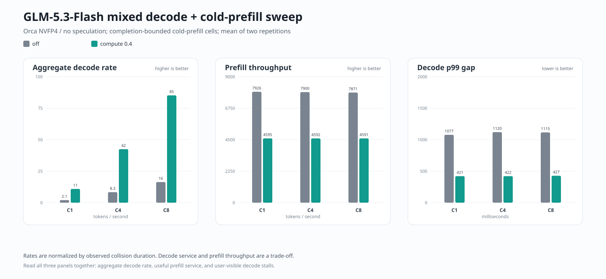

# GLM-5.3-Flash: Orca checkpoint qualification

An independent test of the Orca abliterated FP8 and NVFP4 checkpoints on **four RTX PRO 6000 Blackwell 96 GB GPUs**. The questions are straightforward: how much does the model change, which tasks still work, and what does it take to serve the checkpoint correctly?

**Qualification complete: not cleared for production.** The hour-long soak recorded structured-output HTTP 500s, and required cache observability was incomplete. The original production container was restored and verified; the candidate was not promoted. The owner approved public sharing and chose **no new license grant**.

## What we know

- **The quantization claim is broadly credible.** We measured mean KL **0.0792** from Orca FP8 to Orca NVFP4, compared with the publisher's **0.073**. This is an independent measurement, not an exact replication of the publisher's experiment.
- **Capability retention is mixed, not a uniform collapse and not demonstrably lossless.** Orca NVFP4 scored **55/60** on the deterministic capability battery, versus **60/60** for the original FP8 and **58/60** for the matched NVIDIA NVFP4 control. On the separate functional battery, all four models scored **51/52** for answer semantics.
- **Long-context retrieval worked in the tested cases.** Orca NVFP4 passed **32/32 history cases** and **15/15 cold retrieval cases**, including five inputs of roughly one million tokens. This does not establish general reasoning quality over a million-token document.
- **This was not a drop-in deployment.** We had to correct loader behavior and avoid a failing full-CUDA-graph path before trusting results. The measured NVFP4 path uses **Marlin W4A16**: four-bit expert weights, BF16 expert activations, and FP8 KV. It does not qualify the advertised W4A4 path.

We did not change the model weights, promote the candidate, reproduce a harmful-compliance benchmark, or select the best response from repeated attempts.

## Model-quality results

| Checkpoint | Capability | Functional: answer correct | Functional: strict format | Vision |
|---|---:|---:|---:|---:|
| Original GLM FP8 | **60/60** | 51/52 | 47/52 | 9/12 |
| Orca abliterated FP8 | **57/60** | 51/52 | 43/52 | 8/12 |
| NVIDIA NVFP4, matched test profile | **58/60** | 51/52 | 43/52 | 11/12 |
| Orca abliterated NVFP4, no speculation | **55/60** | 51/52 | 49/52 | **12/12** |

All four passed the six supplementary reasoning, language, structured-output, tool-workflow and benign over-refusal cases. These are small, purpose-built suites—not an estimate of general intelligence or a replacement for broad coding benchmarks.

**Correct answers and usable formatting are different measurements.** The strict scorer rejected some numerically correct JSON answers because the model added an explanation. The semantic scorer assesses the answer separately; strict failures remain visible. Likewise, one legacy capability answer key was objectively wrong. It was corrected for every arm from the frozen outputs, without regenerating responses.

- [Machine-readable quality table](results/model-quality.json)
- [Quality CSV](results/model-quality.csv)
- [Scoring rules and corrections](docs/methods.md)
- [Case-level findings](docs/findings.md)

## Fidelity: three comparisons, not one

The primary measurement uses **12 disjoint 2,048-token WikiText-2 test windows**, or **24,564 predicted positions**. Every position includes the full **154,880-token output vocabulary**. An additional four benign panels are reported separately in the raw comparisons.

| Reference → candidate | Mean KL, nats/token | Top-1 agreement | Candidate perplexity |
|---|---:|---:|---:|
| Original FP8 → Orca FP8 | **0.0299** | 94.82% | 2.7834 |
| Orca FP8 → Orca NVFP4 | **0.0792** | 91.60% | 2.8748 |
| Original FP8 → Orca NVFP4 | **0.0814** | 91.32% | 2.8748 |

Original FP8 perplexity was **2.7675**. The combined change is approximately **+3.88%** on this corpus. KL is directional and is **not additive**: the first two rows must not be summed. Neither KL nor perplexity is an "intelligence-loss percentage."

The captures use the same token IDs, runtime image, TP4, eager execution, and FP8 KV settings. Different checkpoint formats still select different quantization kernels; this measures their actual serving behavior, not an idealized quantizer in isolation. The repaired NVFP4 path also includes its extra BF16 up-projection rounding.

[Full fidelity summary](results/fidelity.json) · [Exact method and limitations](docs/methods.md)

## Sustained decode speed

Two 45-second measurements per cell. The table shows the mean at nominal zero extra context. **C4 and C8 are aggregate throughput across all streams, not speed per user.**

| Profile | C1 tok/s | C4 total tok/s | C8 total tok/s |
|---|---:|---:|---:|
| NVIDIA NVFP4 control, no speculation | 16.48 | 64.20 | 128.43 |
| Orca NVFP4, no speculation | 16.20 | 64.34 | 128.17 |
| Orca NVFP4, MTP-3 | 31.59 | 125.71 | 223.77 |
| Orca NVFP4, DFlash2-7 | 33.33 | 114.25 | 227.47 |

These are the conservative **Marlin/piecewise-graph test profiles**, not the existing production server's normal configuration or its performance. Both speculative modes completed the capability/API/vision checks and both speed trials; their exact scores and failures remain in the data.

The full matrices also cover nominal 32K and 128K contexts. Four cells exceed a 2% **sample-CV** flag; two exceed 2% under either sample or population CV. Both definitions and every raw sample are reported. We did not rerun noisy cells until they looked good.

[Full throughput table](results/throughput.csv) · [Definitions and variability](results/throughput.json)

Steady speculative counters and the client-side prefill scouting observations are also retained: [acceptance and verifier steps](results/speculation.json) · [prefill measurements](results/prefill.csv). The scouts are not a standalone sustained prefill benchmark.

## Runtime findings that matter

1. **An apparently healthy server can load this checkpoint incorrectly.** The stock W4A4 attempt produced a repeated-token loop rather than a useful answer.
2. **The NVFP4 loader dropped independent gate/up scales.** The checkpoint has 8,291 expert pairs with different global divisors. The isolated repair applies the correct per-expert ratio before gated activation and clipping. A real GPU numerical negative control distinguishes the broken and corrected paths.
3. **The FP8 loader misclassified 400 BF16 matrices.** HF exclusion names did not match the wrapped native namespace. Correcting the matching rule was necessary before using either FP8 checkpoint as a reference.
4. **Full-graph replay failed under concurrency in the NVIDIA control.** Disabling async scheduling and changing DCP did not fix it. Piecewise graphs passed the bounded concurrency checks and the sustained matrices. The underlying full-graph kernel failure is not claimed fixed.
5. **Benchmark errors are not model errors.** We preserve the failed offline block-size setup, the incorrect legacy oracle, strict-versus-semantic rescoring, and the old fairness-client API rejection alongside the valid measurements.

[Chronology, repairs and supporting receipts](docs/findings.md)

The patches are scoped to these pinned GLM checkpoints and tested configurations. They are not a general endorsement of other model families, activation layouts, LoRA or expert-parallel paths.

## Long context and operational qualification

The history suite includes explicit reasoning-clearing controls. Some controls deliberately reduce the actual input to a short prompt, so the nominal history size is not used as the measured context length.

The 15 retrieval cases use fresh salted archives at five approximate depths for each nominal target. Actual one-million-token inputs were **999,652–999,691 tokens**, and all five exact-code answers passed. [Actual input lengths and history totals](results/long-context.json)

The repaired mixed-load sweep completed all 12 cells. Compute-share fairness retained about **67–68% of decode speed**, versus **12–13% with fairness off**, while reducing prefill throughput from about **7.9K to 4.6K tokens/s**. These were completion-bounded windows, so rate and latency comparisons—not raw token totals—are used.



Cache lifecycle recorded **35 passing gates, 0 failing gates, 3 unavailable observations and 1 not-applicable gate**. Its overall verdict is not a pass because a required server-abort observation was unavailable. The separate mixed-restore/isolation probe passed **29/29 requests**. No all-rank KV-byte equality is inferred from matching answers.

The full **3,600-second MTP-3 soak** recorded 1,289 logical workload attempts: **19 HTTP 500s**, **55 wrong answers** (53 string reversals, 2 recurrence calculations), 1,202 passes and 13 planned phase-boundary cancellations. The runtime errors occurred at concurrency 4/8 in schema-constrained arithmetic. XGrammar rejected generated tokens and terminated individual requests; the engine stayed up. There were no repetition-heuristic candidates. These errors are not attributed specifically to abliteration or quantization without a matched soak control. [Operational results and counting rules](results/operations.json)

## Where the evidence lives

| Location | Purpose |
|---|---|
| `results/` | Small JSON/CSV tables suitable for browsing and comparing |
| `docs/methods.md` | Protocol, settings, scoring, uncertainty and limitations |
| `docs/findings.md` | Findings and failed-attempt chronology with evidence paths |
| `campaign/` | Actual campaign runners, diagnostics and isolated runtime repairs |
| `harness/` | Required shared helpers and the pinned upstream throughput benchmark |
| `fixtures/` | Fixed prompts, declared acceptance, oracle policy and input inventories |
| `tools/` | Result-table generation, evidence export and verified restore |
| `tests/` | Offline regressions for evidence privacy and archive integrity |
| `evidence/index.json` | Generated manifest for the final sanitized export |

The complete bundle contains **7,291 files in 97 assets: 27.87 GB compressed, 61.56 GB unpacked**. A **59.71 MB text-only asset** restores 7,195 files without the 96 numerical arrays. Every asset is below GitHub's 2 GiB per-asset limit.

Both full and text-only restores were exercised. All 12 reported result artifacts were regenerated from restored data with identical values; 23 offline privacy/integrity regressions pass. [Verification receipt](results/publication-verification.json)

The fidelity capture directory occupies approximately **60.9 GB (56.7 GiB)**. Its bulky arrays belong in separately downloadable, checksummed release assets—not in Git history. The export includes successful, failed and interrupted attempts. Model weights, private authorization material, generated caches and vendor runtime binaries available from the pinned image are excluded; every excluded file is accounted for with a reason.

Numeric captures are preserved byte-for-byte after decompression. Text evidence is minimally sanitized for credentials and machine-private identifiers. The manifest distinguishes the original-source hash from the published-file hash and records redaction categories without recording secret values.

For concrete download, analysis, image-build and guarded-run commands, see
[Reproduce the study](docs/reproduce.md).

The downloader verifies compressed assets and unpacked files, rejects unsafe archive paths and extensions, and installs only a verified tree. `--assets text` restores text/source evidence without fetching the numerical arrays; `--assets all` restores the full export. The subset is never labeled complete.

Use the [repository's releases](https://github.com/jcartu/glm53-orca-qualification/releases) for raw-data assets together with `evidence/index.json`. A source-code ZIP alone does not contain the numerical captures.

## Reproduction and safety

Start with [the methods](docs/methods.md), [dependency provenance](dependency-provenance.json), and [source provenance](source-provenance.json).

- The harness is for a Linux four-GPU rig with Docker/NVIDIA support. It expects an existing idle production container named `glm53-prod` on loopback port 5001, uses a dedicated test container on port 5002, and restores the captured original container ID in `finally`.
- Set `ORCA_MODEL_ROOT`, `ORCA_STATE_DIR` and `ORCA_CACHE_ROOT` explicitly for your machine. Fresh checkpoint verification writes state outside tracked code; historical "passed" receipts are not a substitute.
- Build the corrected image from `campaign/runtime-repair/Dockerfile.fp8-exclusions`, using its pinned R38 base. Select it with `BATTERY_IMAGE`; the runner resolves the image to an immutable ID before pausing production. It does not fall back to an unpatched image.
- Download the model checkpoints yourself from their publishers at the recorded revisions. This repository contains no weights and does not accept access gates on your behalf.
- The tested DFlash2 artifact is now published under `local-inference-lab/GLM-5.3-Flash-DFlash2`, revision `713226ab03bc38afdf955c7450436c2f7176f6f8`. Its bytes match the locally tested `-MXFP8` directory. Its **CC BY-NC-ND 4.0** license is separate from the target model and this report.
- The checksum-verification `hf` CLI used here is **1.22.0**, installed separately from the host Python package pins. Evidence compression uses **zstd 1.5.7**.
- Generated model code is evaluated only in bounded, non-networked, non-GPU, unprivileged Docker sandboxes—not on the host.

To regenerate all completed result tables from restored evidence:

```sh
python tools/summarize_results.py --evidence-root /path/to/restored/evidence --output-dir results
```

To exercise the offline publication-tool regressions:

```sh
python tests/test_evidence_tools.py
```

## Attribution and publication status

This work builds on Z.ai's model, OrcaRouter's derivatives, NVIDIA's checkpoint, Inco AI's draft, the vLLM project, and the local-inference-lab community's serving and benchmark tooling. Their claims are attributed separately from measurements made here.

See [third-party notices](THIRD_PARTY_NOTICES.txt). Upstream code and corpus material retain their own licenses. **No new repository-wide license is granted for the original code, fixtures or report.**
